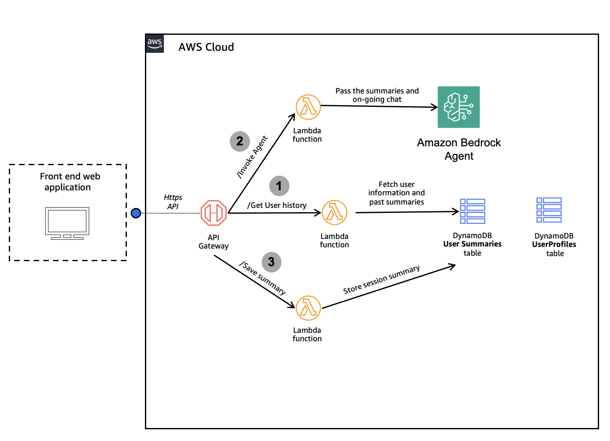

# Domestic Violence Response Coaching System

## Solution Overview

### The Problem

Domestic violence response specialists face significant challenges when conducting victim calls and chat supportr:
- Navigating culturally sensitive conversations
- Making accurate risk assessments under pressure
- Documenting cases thoroughly while focusing on the victim
- Lacking context when multiple specialists handle a case, forcing victims to repeat traumatic details
- Maintaining protocol compliance while being empathetic


### The Solution

The Domestic Violence Response Coach is a Generative AI-powered system designed to shadow specialists at women's protection centers during live sessions with domestic violence victims. It assists specialists by:

- Suggesting appropriate questions with the right emotional tone
- Following the DASH 2009 risk assessment framework
- Operating bilingually in both English and Saudi Arabic dialect (Najdi) for more natural, human-based interactions
- Providing inclusive support through complementary protocols for persons with disabilities (Stay Safe) and elderly victims (WHO guidelines)
- Summarizing sessions to maintain context across different specialists and prevent victims from repeating information

We leverage Amazon Bedrock with Anthropic's Claude 3.5 Sonnet v2 to provide real-time guidance to specialists, ensuring they follow established protocols while maintaining cultural sensitivity.


### Key Benefits

- **Real-time Guidance**: Provides specialists with immediate suggestions during critical conversations
- **Protocol Adherence**: Ensures compliance with the DASH Risk Model.
- **Cultural Sensitivity**: Responds in English and natural Saudi dialect Arabic (Najdi) with culturally appropriate language
- **Risk Assessment**: Accurately evaluates risk levels and recommends appropriate actions
- **Specialized Support**: Includes dedicated protocols for elderly victims and persons with disabilities
- **Efficient Documentation**: Generates comprehensive session summaries and risk reports


This solution is the first to combine advanced AI capabilities with established domestic violence response protocols in a culturally sensitive manner, specifically designed for women's protection centers.

## Architecture




### System Workflow

The Domestic Violence Response Coaching system follows these three primary steps:


#### 1. Case Information Retrieval
- Using the retrieved user profile, the specialist retrieves detailed case information
- The GetUserCaseDetails Lambda function fetches data from DynamoDB (UsersProfiles) and (UserSummaries) for the previous sessions' summaries.
- This provides context from previous sessions and case history

#### 2. Real-time Agent Invocation
- During the specialist's interaction, real-time assistance is provided by the InvokeAgent Lambda function
- The Bedrock Agent uses Claude 3.5 Sonnet v2 to:
  - Suggest appropriate questions
  - Provide coaching tips on tone and approach
  - Assess risk levels in real-time
  - Offer actionable insights based on conversation context and historical summaries
- The agent follows established protocols:
  - DASH (2009) Risk Identification and Assessment Model
  - Complementary protocols for elderly and disabled victims

#### 3. Session Summarization
- At the end of the session, the specialist requests a session summary
- The InvokeAgent Lambda function generates a structured summary with recommended next steps
- The specialist reviews, optionally edits, and confirms the summary
- The SaveSummary Lambda function stores this information in DynamoDB (UserSummaries)
- This summary provides critical context for future sessions


## Deployment Instructions

### Prerequisites

- AWS CLI installed and configured
- Appropriate permissions to create CloudFormation stacks, Lambda functions, IAM roles, and Bedrock agents
- Amazon Bedrock access with Claude 3.5 Sonnet v2 model enabled in your region

### Deployment Steps

1. Clone this repository:
   ```bash
   git clone https://github.com/reefkha2/domestic-violence-response-coach.git
   cd domestic-violence-response-coach
   ```

2. Deploy using AWS CLI:
   ```bash
   aws cloudformation deploy \
     --template-file simplified_template.yaml \
     --stack-name domestic-violence-response-system \
     --capabilities CAPABILITY_NAMED_IAM
   ```

3. Monitor the deployment in the AWS CloudFormation console. Deployment typically takes 5-10 minutes to complete.

## Using the System

### API Endpoints

After successful deployment, the CloudFormation stack outputs the API Gateway endpoint URL. This serves as the base URL for all API calls.

### Available API Routes

| Method | Endpoint | Description | Request Body/Parameters | Response |
|--------|----------|-------------|------------------------|----------|
| POST | /invokeAgent | Invokes the Bedrock agent | `{"input": "user message", "sessionId": "optional-session-id"}` | `{"response": "agent response", "sessionId": "session-id"}` |
| GET | /getUserCaseDetails | Gets case details for a user | Query param: `caseId=case-id-value` | `{"profile": {user-profile}, "summaries": [{summary-entries}]}` |
| POST | /saveSummary | Saves a case summary | `{"caseId": "case-id", "summary": "session summary text"}` | `{"message": "Summary saved successfully", "caseId": "case-id", "timestamp": "timestamp"}` |

### Integration Example

```javascript
// Example: Invoking the agent from a frontend application
async function invokeAgent(userInput, sessionId = '') {
  const apiUrl = 'https://your-api-gateway-url.execute-api.region.amazonaws.com/prod/invokeAgent';
  
  const response = await fetch(apiUrl, {
    method: 'POST',
    headers: {
      'Content-Type': 'application/json'
    },
    body: JSON.stringify({
      input: userInput,
      sessionId: sessionId
    })
  });
  
  return await response.json();
}
```

## Resource Cleanup

To delete all resources created by this template:

```bash
aws cloudformation delete-stack --stack-name domestic-violence-response-system
```

The template has been configured with appropriate deletion policies to ensure all resources are properly cleaned up when the stack is deleted.

## License

This solution is provided under the MIT License and can be freely modified and distributed according to your organization's requirements.
